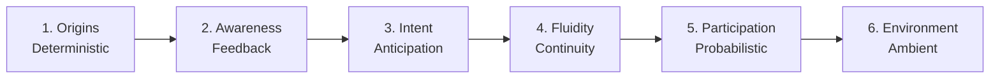

# Living Interface Ecosystem: A Narrative Exploration


### [Live Demo](https://Ashborn-047.github.io/Living-Interface-Ecosystem/)

> "The web is no longer something we look at. It is something we walk through."

The **Living Interface Ecosystem** is a high-fidelity React demonstration designed to showcase the transition from **Static Tools** to **Lived-in Environments**. It explores how digital interfaces are evolving beyond deterministic input-output boxes into organic, context-aware participants that breathe, react, and anticipate.

---

## 🗺️ Evolution Roadmap



## 🎯 The Goal: Redefining Continuity

The primary intention of this project is to visualize the **Phases of Interface Evolution**. Most modern software still operates on a "Stop and Start" paradigm—users click, wait for a loading spinner, and then react to new state. 

This project intends to solve for **Digital Continuity**:
- **From Deterministic to Probabilistic**: Moving from rigid commands to inferred intent.
- **From Box to Space**: Transitioning from 2D containers to simulated 3D environments with gravity and presence.
- **From Tool to Participant**: Creating UI that doesn't just "wait" for the user, but actively participates in the interaction.

---

## 🌌 The Philosophy: Why This Matters

### The Problem with Modern Interfaces

We've plateaued. Despite decades of progress, most digital interfaces still operate on a fundamental assumption from the 1970s: **the user initiates, the system responds**. This creates a cognitive gap—a constant reminder that we are operating *through* a tool rather than *within* an environment.

Consider how you interact with the physical world. You don't "click" on a door handle and wait for a loading state. The handle yields to your touch with continuous, predictable feedback. The room you enter doesn't "render"—it was always there, waiting.

**Why can't software feel the same way?**

### The Shift: From Instrument to Habitat

This project is an attempt to visualize a paradigm shift that is already underway in the most cutting-edge interfaces:

| Era | Paradigm | User Role | Interface Role |
|-----|----------|-----------|----------------|
| **1980s** | Command Line | Operator | Executor |
| **2000s** | GUI | Controller | Responder |
| **2020s** | Touch/Voice | Director | Anticipator |
| **2030s** | Ambient | Inhabitant | **Participant** |

We are moving from interfaces that *wait* for instructions to interfaces that *infer* intent. From tools we *use* to spaces we *inhabit*.

### What Makes This Different?

1. **Narrative Architecture**: Instead of a static portfolio or documentation site, this is a *story* told through scroll. Each phase builds on the last, creating a sense of progression and discovery.

2. **Single Morphing Entity**: The central "Artifact" is not six different components—it's *one* entity that transforms. This mirrors how we, as humans, are not discrete states but a continuous flow of identity.

3. **Physics Over Keyframes**: Every animation is rooted in physical principles—elasticity, inertia, gravity. This creates an uncanny familiarity, making the digital feel *tangible*.

4. **The Climax as Environment**: The final phase doesn't just *describe* ambient interfaces—it *becomes* one. The artifact explodes into a full-screen wash, enveloping the user in the very concept being discussed.

### The Significance: A New Language for UI

This project is a **vocabulary builder** for designers and developers. It provides concrete, interactive examples of concepts that are often discussed abstractly:

- **"Non-blocking UI"** → See the ICU pulse rhythm that communicates activity without freezing flow.
- **"Anticipatory Design"** → Experience the hover-to-slide intent animation.
- **"Probabilistic Interfaces"** → Watch the magnetic parallax that reacts to your presence, not your clicks.
- **"Ambient Computing"** → Be enveloped by the environment wash—you are no longer *looking at* the interface, you are *inside* it.

### Who Should Experience This?

- **Designers** seeking inspiration for next-generation interaction patterns.
- **Developers** wanting to study high-performance CSS animation and morph architecture.
- **Product Thinkers** exploring the future of human-computer interaction.
- **Anyone** who has ever felt that software could be more... *alive*.

---

## 🧬 The "Living Artifact"

At the heart of the experience is a single, persistent **Living Artifact**. As you scroll through the narrative, this artifact morphs through six distinct stages:

### 1. Origins (Deterministic Root)
The system begins in a state of pure hierarchy. A vintage terminal interface where the system waits for explicit commands. 
- **Intent**: To remind us of the "System Boot" era where humans spoke only in strings.

### 2. Feedback (Awareness)
The interface begins to acknowledge presence. Buttons respond with **Elastic Physics**, stretching and tilting based on cursor velocity.
- **Intent**: Demonstrating "Active Confirmation"—the UI is no longer a flat image, but a tactile surface.

### 3. Intent (Anticipation)
The UI begins to guess the next move. Hover-to-slide interactions reveal content before a click is ever registered.
- **Intent**: Showing how motion can guide the eye and reduce cognitive friction through anticipation.

### 4. Fluidity (Continuity)
The "Pause" is removed. Loading states are replaced by **ICU Pulse Rhythms** and organic blobs that simulate life behind the glass.
- **Intent**: To show that internal system health can be communicated through "heartbeats" rather than spinners.

### 5. Probabilistic (Participation)
The artifact becomes a complex, glowing core that reacts to the cursor with **Magnetic Parallax** and neon "breathing."
- **Intent**: Representing the AI-era interface that acts alongside the user, inferring context from noise.

### 6. Environment (Lived Space)
The artifact finally "explodes" to become the environment itself. The UI is no longer *on* the screen; it *is* the screen.
- **Intent**: Visualizing the "Ambient Web" where interaction is immersive and pervasive.

---

## ✨ Design Principles

- **Vibrant & Multi-dimensional**: Using custom HSL-tailored colors and glassmorphism.
- **Physics-First**: Rejecting linear easing in favor of elastic, rubber-band inertia.
- **Narrative Scroll**: Content isn't just displayed; it's *discovered* through interaction.
- **Zero-Latency Feel**: Optimistic rendering and continuous motion to eliminate the perception of loading.

---

## 🛠️ Technical Innovation

### **Elastic Surface Physics** (custom implementation)
We implemented a custom `handleElasticMove` hook that calculates the normalized distance of the cursor from the center of an element, applying dynamic `perspective` and `rotate` transforms in real-time.

### **ICU Pulse Animation**
Rather than standard CSS keyframes, the Fluidity stage uses a "Heartbeat" rhythm (`icu-pulse`) that simulates a living biological system, communicating background activity without the "anxiety" of a loading bar.

### **Morphing Continuity**
The project uses a **Single Persistent Component** architecture. Instead of destroying and mounting new components for each section, the central `Artifact` component morphs its state, size, and CSS variables across transitions, ensuring visual continuity.

## 📂 Project Structure

```text
Living-Interface-Ecosystem/
├── .github/          # CI/CD Workflows (Auto-deploy to Pages)
├── src/
│   ├── components/   # The Morphing Artifact & Section Layouts
│   ├── hooks/        # Reactive mouse & scroll state managers
│   ├── styles/       # Atomic CSS (Animations, Tokens, Layouts)
│   └── main.tsx      # Entry point
├── public/           # Static assets & metadata
└── vite.config.ts    # Build optimization for GitHub Pages
```

## 🏁 Getting Started

### Prerequisites
- **Node.js**: v20 or higher
- **NPM**: v10 or higher

### 🚀 Local Development

1. **Clone the repository**:
   ```bash
   git clone https://github.com/Ashborn-047/Living-Interface-Ecosystem.git
   ```
2. **Install dependencies**:
   ```bash
   npm install
   ```
3. **Run development server**:
   ```bash
   npm run dev
   ```
4. **Build for production**:
   ```bash
   npm run build
   ```

## 🤝 Contribution & Support

This project is a experimental capstone. If you find bugs or have ideas for weird new interface stages:
1. Fork the project.
2. Create your Feature Branch (`git checkout -b feature/AmazingFeature`).
3. Commit your changes (`git commit -m 'Add some AmazingFeature'`).
4. Push to the Branch (`git push origin feature/AmazingFeature`).
5. Open a Pull Request.

---

## 🏗️ Technical Specifications

- **React 19 & Vite**: Leveraging the latest in React concurrency and Vite's lightning-fast HMR.
- **TypeScript**: Full type-safety for complex animation states and stage transitions.
- **Vanilla CSS Architecture**: No heavy animation libraries (like Framer Motion). All effects are hand-optimized using CSS Transforms and Transitions for 60fps performance on low-end hardware.
- **Lucide Geometry**: Procedural svg manipulation using Lucide icons as base seeds for the kinetic typography.

## 📄 License

This project is licensed under the MIT License - see the [LICENSE](LICENSE) file for details.

---

*“The interface is no longer waiting.”*
